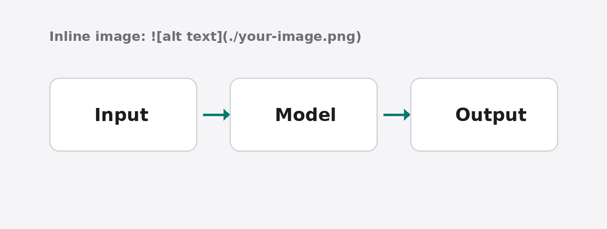

Open with the question the post answers and why it matters. The body is Markdown: paragraphs, `## headings`, lists, **bold**, `inline code` and [links](https://example.com).

## Images

Put the image in this writing's folder and reference it with a relative path. The build checks the file exists and resizes it for the web.



> A pull quote states the single most important point in one sentence.

## Code and output

<Code filename="run.py">
```python
print("hello")
```
</Code>

<Output text={`$ python run.py
hello`} />

<Note>Small print under a code block, e.g. how to run it.</Note>

## Charts and formulas

<Formula expr="throughput = requests / seconds" caption="Define any formula the results depend on." />

<Figure title="Latency by input size" caption="Describe what the chart shows." chart={{ x: ["1k", "10k", "100k"], yMax: 50, yStep: 10, yLabel: "ms", series: [{ name: "Baseline", tone: "muted", values: [4, 12, 41] }, { name: "Proposed", values: [2, 6, 17] }] }} />

## Conclusion

Summarize the finding and what comes next.[^1]

[^1]: Footnotes work like this.
